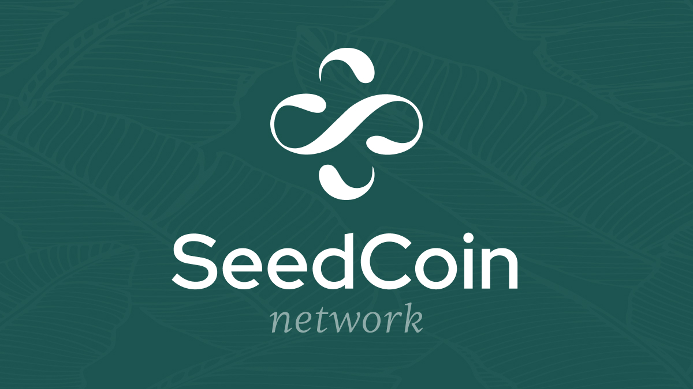

## SeedCoin-Network

The SeedCoin-Network is a blockchain running with care for the environment and future. We enable teams to develop great user-friendly dApps, use Smart Contracts, and create NFTs.

To find out more about SeedCoin-Network, visit the [official website](https://seedcoin.network/).

WARNING: This is a work in progress so architectural changes may happen in the future. The code has not been audited yet, so please contact [SeedCoin-Network team](mailto:support@seedcoin.network) if you would like to use it in production.

## Documentation 📝

apt-get update

apt-get upgrade -y

cd /home/

apt-get install golang-go -y

git clone https://github.com/SeedCoin-Network/seedcoin-network

cd seedcoin-network/

go build -o seedcoin-network main.go

sudo mv seedcoin-network /usr/local/bin

sudo mv chain/chains/seedcoin.json ../genesis.json

cd ..

seedcoin-network server --data-dir ./data-dir --chain genesis.json --grpc-address 0.0.0.0:10000 --libp2p 0.0.0.0:10002 --jsonrpc 0.0.0.0:10004

---

Copyright 2022 Polygon Technology

Licensed under the Apache License, Version 2.0 (the "License");
you may not use this file except in compliance with the License.
You may obtain a copy of the License at

       http://www.apache.org/licenses/LICENSE-2.0

Unless required by applicable law or agreed to in writing, software
distributed under the License is distributed on an "AS IS" BASIS,
WITHOUT WARRANTIES OR CONDITIONS OF ANY KIND, either express or implied.
See the License for the specific language governing permissions and
limitations under the License.
